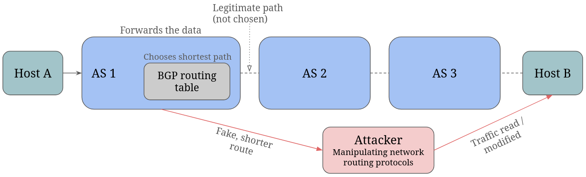
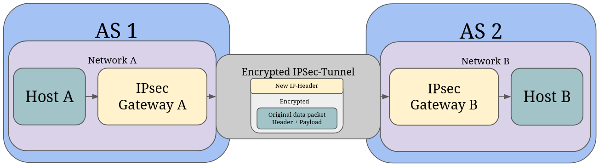
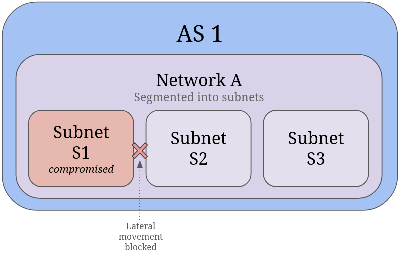
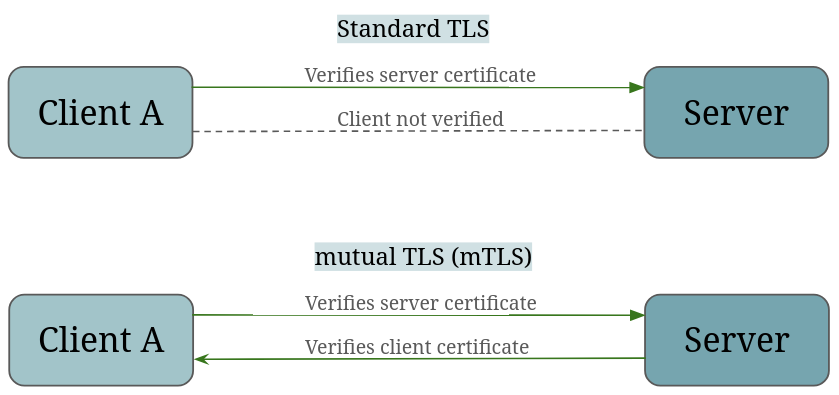

Starting this fall, I'm taking the **Network Security MSc module** as part of my CAS in Computer Science at ETH Zurich.

Network Security is vital in Data Engineering because usually data is distributed around different systems. And therefore: ***Every data pipeline is only as trustworthy as the network it runs on.***

I'm really excited to deep dive into network security techniques and how networks get compromised (attack vectors). It's a super exciting space, especially when you look from a Data Engineering angle. Below are a few teasers on why I find this field so interesting.

### Securing Networks in Modern Data Stacks

Historically, network security in data infrastructure was largely handled through perimeter defense. In other words, the firewall acts as first line of defense to block external threats, while internal traffic is classified as trusted.
Firewalls remain an essential foundation for perimeter control, but relying alone on this strategy has a few major limitations:  

- Once an attacker bypasses that boundary, unrestricted lateral movement across the entire network is possible.
- This model incorrectly assumes that all internal users are friendly (ignoring insider threats).

Modern architecture enhance perimeter firewalls with a Zero trust approach - never trust, always verify - for example through network segmentation and mTLS.

On the of top that, data stacks are nowadays often decentralized across multi-cloud environments, which introduces new requirements on network infrastructure.

Understanding where security mechanisms live across the network layers fundamentally changes how we design robust and secure data architectures. Here are a few topics I'm particularly looking forward to:

* **BGP (Border Gateway Protocol) Security:** The moment data crosses network boundaries, data packets rely on inter-domain routing between Autonomous Systems (AS is a big network. Interconnected AS(s) make up the internet). Unsecured BGP puts data replication at risk of traffic hijacking. (Image: attack vector through misrouting traffic)

* **IPsec & VPN Tunnels:** Encrypted tunnels for network to network communication. IPsec is a so called site-to-site-VPN. The following visualization illustrates an IPsec Tunnel where Gateway A encrypts and encapsulates an original payload from Network A with a new outer IP header for secure transport across the network. 

* **Network Segmentation:** Isolation via virtual networks or subnets allows isolating ingestion and to restrict lateral movement after a breach.

* **(D)DoS Attacks & Defenses:** Attackers flood a network or a service with overwhelming traffic.
* **TLS & Mutual TLS (mTLS):** Standard TLS only authenticates the server. Moving to mTLS establishes identities of the peers. In distributed systems, mTLS guarantees that services don't just encrypt payloads, they continuously authenticate both ends of the connection.

* **DNS Security:** Poisoned DNS caches can misroute sensitive ETL jobs.

#
#### Quick Recap: 7-Layer Network Model

Internet protocols are typically discussed along the OSI model (7 layers) which is an ISO standard or the more condensed TCP/IP model with 4 layers. Below the OSI model:

* Layer 7: Application Layer (HTTP, DNS, BGP) <- BGP routing logic lives here to direct Layer 3 traffic.
* Layer 6: Presentation Layer (e.g. data encryption)
* Layer 5: Session Layer (session management)
* Layer 4: Transport Layer (TCP, UDP, TLS/mTLS)
* Layer 3: Network Layer (IP) <- IPsec encrypts here entire packets for secure data transit across networks.
* Layer 2: Data Link Layer (Ethernet, Switch) <- Network segmentation & Subnets live here.
* Layer 1: Physical Layer (Hardware, optical fiber, datacenter infrastructure)  <- DDos Resilience & physical security are built here.
#

### Data Platform Implications

As data pipelines scale, network context becomes just as critical as storage and compute resources.

1. **Certificate lifecycle management** replaces static API keys for service-to-service identity.
2. **Traffic monitoring** becomes a key observability metric alongside query latency and throughput.
3. **Zero trust by default** for all data in transit.

I'll be sharing architectural takeaways and lessons learned as the semester progresses. 
Stay tuned as the state changes :)

#

### Sources

* Module Description Network Security, https://vvz.ethz.ch/Vorlesungsverzeichnis/lerneinheit.view?semkez=2026W&ansicht=KATALOGDATEN&lerneinheitId=204555&lang=en (July 2026, online)
* What is an autonomous system. https://www.cloudflare.com/de-de/learning/network-layer/what-is-an-autonomous-system/ (August 2026, online)
* OSI Model. https://en.wikipedia.org/wiki/OSI_model (July 2026)
* What is IPsec. https://www.cloudflare.com/learning/network-layer/what-is-ipsec/ (July 2026)
* BeyondCorp. Zero Trust Computer Security concepts. https://en.wikipedia.org/wiki/BeyondCorp (July 2026)
* DNS Spoofing. https://en.wikipedia.org/wiki/DNS_spoofing (July 2026)

#### Support of Agentic AI:
* Text has been refined with Google Gemini and Claude

